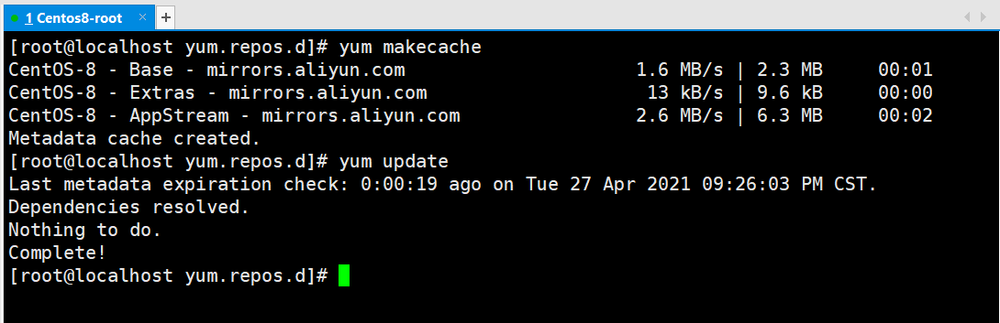
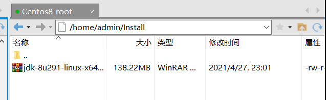
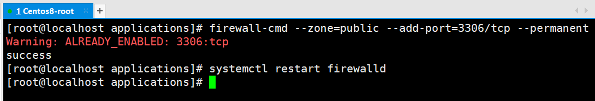

# Centos8 环境搭建指南

## 导入

最近总爱整些 **花里胡哨** 的东西，导致我的 **Linux** 系统有很多莫名其妙的东西，所以经常回去重新安装，说到这儿，那么问题就来了，对于不爱用 **快照** 的我来说，每次都要配置环境，一点儿不对，就又会有什么奇奇怪怪的错，所以现在将我在使用过程中，对于 **Linux** 环境配置的一些记录。

> **环境：**
>
> - Centos 8
> - VMware Workstation Pro 16.x
> - Xshell 7
> - Xftp 7

---

## yum 换源

使用命令进入：

```bash
cd /etc/yum.repos.d
```

为了以后有需要，会恢复原有的文件，所以将 **Centos8** 自带的文件先保存起来：

新建一个文件夹用来保存：

```bash
mkdir yum.repos.old
```

将所有文件都移动到该文件夹下：

```bash
mv *.repo yum.repos.old/
```


接着，使用 **wget** 下载新的源：

```bash
wget http://mirrors.aliyun.com/repo/Centos-8.repo
```


接着清除以前的 **yum** 缓存：

```bash
yum clean all
```


最后创建新的缓存：

```bash
# 创建缓存
yum makecache
# 更新
yum update
```



---

## JDK1.8（Oracle）

首先要去 **Oracle** 的官网上去下载 **Linux** 版的 JDK:

> 下载页面：[https://www.oracle.com/cn/java/technologies/javase/javase-jdk8-downloads.html](https://www.oracle.com/cn/java/technologies/javase/javase-jdk8-downloads.html) > 
> 选择一个合适的版本来下载。
> 在 **Linux** 的环境中，创建一个用于安装的文件夹：

```bash
cd /home/admin
mkdir Install
```


使用 **Xftp** 将下载好的压缩包上传至新建的文件夹：

接着，在该文件夹下解压文件：

```bash
cd Install
# 解压文件
tar -zxvf jdk-8u291-linux-x64.tar.gz
```

待解压完成，使用命令，删除原来的压缩包。

```bash
rm -rf jdk-8u291-linux-x64.tar.gz
```


接着，就可以配置环境变量了：

```bash
vi /etc/profile
```

在文件最后添加上以下内容：

```
JAVA_HOME=/home/admin/Install/jdk1.8.0_291
PATH=$PATH:$JAVA_HOME/bin
CLASSPATH=.:$JAVA_HOME/lib/dt.jar:$JAVA_HOME/lib/tools.jar
export JAVA_HOME PATH CLASSPATH
```


运行命令让配置生效:

```bash
source /etc/profile
```


---

## MySQL 8.x

在安装 **MySQL** 之前，需要更换 **yum** 源，接着使用 **yum** 来安装 **MySQL**。

### 卸载

首先，确认当前是否有其他的 **MySQL** 的版本：

```bash
rpm -qa | grep mysql
```


> 如果这里显示什么都没有则直接可以直接进行安装。

如果有已经安装了某个版本，则需要通过命令来卸载：

```bash
# 普通删除模式
rpm -e mysql
# 强力删除模式，如果使用上面命令删除时，提示有依赖的其它文件，则用该命令可以对其进行强力删除
rpm -e --nodeps mysql
```


**但是，** 当你再次运行的时候你会发现，还是会有一些残留:


那么就需要使用 **yum** 来卸载：

```bash
yum remove <包名>
```

> 将所有包依次删除。

或则直接一次性全删除：

```bash
yum remove mysql*
```


依次将所有的 **MySQL** 依赖都卸载完后再次查看：


**什么也没有，就说明已经卸载完成了。**
为了保证这之后安装 **MySQL** 的干净环境，还可以选择删除所有的 **MySQL** 文件夹：

```bash
# 查找文件夹
find / -name mysql
# 查找并删除文件及文件夹
find / -name mysql | xargs rm -rf
```


---

### 安装与万能重置密码

卸载干净之后，接下来就可以开始安装了，打开以下的地址，获取 **yum** 下载地址：

> 下载地址：**[https://dev.mysql.com/downloads/repo/yum/](https://dev.mysql.com/downloads/repo/yum/)**

获取到对应的具体信息:

在 **MySQL** 的安装位置，进行下载：

```bash
# 在详细信息的链接前加上 http://repo.mysql.com/
wget http://repo.mysql.com/mysql80-community-release-el8-1.noarch.rpm
```


接着使用 **rpm** 包管理安装：（当前目录)

```bash
rpm -ivh mysql80-community-release-el8-1.noarch.rpm
```


> 查询 **MySQL** 相关：
>
> ```bash
> rpm -qa | grep mysql
> ```
>
> 

> 安装完成后就可以将之前下载的文件删除了：
>
> ```bash
> rm -rf mysql80-community-release-el8-1.noarch.rpm
> ```

接着更新 **yum** 源：

最后就可以开始安装 **MySQL** 了：

```bash
yum install mysql-server
```


输入 **y** 后开始安装：

```bash
Is this ok [y/N]: y
Downloading Packages:
(1/7): mariadb-connector-c-config-3.1.11-2.el8_3.noarch.  22 kB/s |  15 kB     00:00
(2/7): mecab-0.996-1.module_el8.2.0+493+63b41e36.9.x86_6 387 kB/s | 393 kB     00:01
(3/7): mysql-common-8.0.21-1.module_el8.2.0+493+63b41e36 279 kB/s | 148 kB     00:00
(4/7): mysql-errmsg-8.0.21-1.module_el8.2.0+493+63b41e36 549 kB/s | 581 kB     00:01
(5/7): protobuf-lite-3.5.0-13.el8.x86_64.rpm             273 kB/s | 149 kB     00:00
(6/7): mysql-8.0.21-1.module_el8.2.0+493+63b41e36.x86_64 1.5 MB/s |  12 MB     00:07
(7/7): mysql-server-8.0.21-1.module_el8.2.0+493+63b41e36 3.2 MB/s |  22 MB     00:06
-----------------------------------------------------------------------------------------
Total                                                    4.4 MB/s |  35 MB     00:08
Running transaction check
Transaction check succeeded.
Running transaction test
Transaction test succeeded.
Running transaction
  Preparing        :                                                                 1/1
  Installing       : mariadb-connector-c-config-3.1.11-2.el8_3.noarch                1/7
  Installing       : mysql-common-8.0.21-1.module_el8.2.0+493+63b41e36.x86_64        2/7
  Installing       : mysql-8.0.21-1.module_el8.2.0+493+63b41e36.x86_64               3/7
  Installing       : mysql-errmsg-8.0.21-1.module_el8.2.0+493+63b41e36.x86_64        4/7
  Installing       : protobuf-lite-3.5.0-13.el8.x86_64                               5/7
  Installing       : mecab-0.996-1.module_el8.2.0+493+63b41e36.9.x86_64              6/7
  Running scriptlet: mecab-0.996-1.module_el8.2.0+493+63b41e36.9.x86_64              6/7
  Running scriptlet: mysql-server-8.0.21-1.module_el8.2.0+493+63b41e36.x86_64        7/7
  Installing       : mysql-server-8.0.21-1.module_el8.2.0+493+63b41e36.x86_64        7/7
  Running scriptlet: mysql-server-8.0.21-1.module_el8.2.0+493+63b41e36.x86_64        7/7
ValueError: File context for /var/log/mysql(/.*)? already defined

  Verifying        : mariadb-connector-c-config-3.1.11-2.el8_3.noarch                1/7
  Verifying        : mecab-0.996-1.module_el8.2.0+493+63b41e36.9.x86_64              2/7
  Verifying        : mysql-8.0.21-1.module_el8.2.0+493+63b41e36.x86_64               3/7
  Verifying        : mysql-common-8.0.21-1.module_el8.2.0+493+63b41e36.x86_64        4/7
  Verifying        : mysql-errmsg-8.0.21-1.module_el8.2.0+493+63b41e36.x86_64        5/7
  Verifying        : mysql-server-8.0.21-1.module_el8.2.0+493+63b41e36.x86_64        6/7
  Verifying        : protobuf-lite-3.5.0-13.el8.x86_64                               7/7
Installed products updated.

Installed:
  mariadb-connector-c-config-3.1.11-2.el8_3.noarch
  mecab-0.996-1.module_el8.2.0+493+63b41e36.9.x86_64
  mysql-8.0.21-1.module_el8.2.0+493+63b41e36.x86_64
  mysql-common-8.0.21-1.module_el8.2.0+493+63b41e36.x86_64
  mysql-errmsg-8.0.21-1.module_el8.2.0+493+63b41e36.x86_64
  mysql-server-8.0.21-1.module_el8.2.0+493+63b41e36.x86_64
  protobuf-lite-3.5.0-13.el8.x86_64

Complete!
```

再次查询是否安装了 **MySQL** :

```bash
rpm -qa | grep mysql
```


设置权限：

```bash
chown mysql:mysql -R /var/lib/mysql
```


接着启动 **MySQL** 并查看状态：

```bash
# 启动服务
systemctl start mysqld
# 查看状态
systemctl status mysqld
```


接着按 **q** 退出后打开 **MySQL** :


当前是没有密码的，无论是那种方式都提示以下内容的话，我们还需要进行其他的操作，
`ERROR 1045 (28000): Access denied for user 'root'@'localhost' (using password: NO)`

首先，停止 **MySQL** 的服务：

```bash
# 停止 MySQL 服务
systemctl stop mysqld
# 查看状态
systemctl status mysqld
```


接着使用 **Linux** 自带的文本编辑器修改配置文件：

```bash
vi /etc/my.cnf
```


弹出以上信息后，按下 **回车** 继续， 接着按下 **a** 或 **i** 进入编辑模式：
在 `[mysqld]` 下加上一句：`skip-grant-tables`，如果没有 `[mysqld]` 标签，则手动加入：

按下 **Esc** ，输入 `:wq` 后回车保存：

接着再次启动 **MySQL** 服务：

```bash
# 启动服务
systemctl start mysqld
# 查看状态
systemctl status mysqld
```


按下 **q** 退出当前状态后，输入`mysql` 直接登录：

```bash
mysql
```


再接着将密码置为空：

```bash
# 切换数据库
use mysql;
# 将密码置空
update user set authentication_string='' where user='root';
```


之后使用 `exit`退出 **MySQL** ，再再接着就是把之前的配置文件所加的内容删除或注释掉：

```bash
vi /etc/my.cnf
```


同样的按下 **Esc** ，输入 `:wq` 后回车保存。
再次使用命令重新启动 **MySQL**：

```bash
systemctl restart mysqld
```


按下 **q** 退出当前状态后，再次登录 **MySQL** ：

> 此时没有密码，在提示输入密码时直接回车

```bash
mysql -u root -p
```


最后，使用命令更改密码：

```bash
# 修改密码
ALTER user 'root'@'localhost' IDENTIFIED BY '你的密码';
# 刷新 MySQL 的系统权限相关表
flush privileges;
```


使用 `exit` 退出后，为保险起见，再次重启 **MySQL** 服务：

之后使用命令登录，输入你之前设置的密码后，就可以看到，登陆成功：


### 远程连接

要在主机上连接虚拟机中的 **MySQL** 就必须开启 **Linux** 的端口：

```bash
# 永久开启 3306 端口
firewall-cmd --zone=public --add-port=3306/tcp --permanent
# 重新加载防火墙
firewall-cmd --reload
```



> 我这里的警告是因为我之前已经开过了，不影响。
> 使用命令查看当前 **Centos8** 的 **IP** ：

```bash
ip addr
```

在 **win10** 的主机上使用 **Navicat** 工具尝试连接：

报错的意思大概是这个地址，是不允许我们连接 **MySQL** 服务器的，**MySQL** 默认不允许远程登录，所以需要开启远程访问权限:
登录 **MySQL** ，依次输入以下的命令：

```bash
# 切换数据库
use mysql;
# 可以查看以下 user 表（非必须）
select user,authentication_string,host from user;
# 修改 root 的 host
update user set host = '%' where user = 'root';
# 刷新权限表
flush privileges;
```


再次进行连接：

