# AGE 动漫下载 requests 版

## 简介

终于放暑假了，其实都还**没有感觉**！在家都待了大半年了，完全忘记了自己之前对放假期待的那种心情~~~
不过无论怎样，都 **挡不住我自学的脚步！！！** 话不多说，马上开始这次的介绍：

此次，我采用了两种方式来完成这一次的爬虫实例：

- 1、**requests 版：** 通过浏览器的开发者工具抓包，分析 **发送的链接** 以及 **返回的数据** 来爬取。
- 2、**selenium 版 ：** 通过驱动 **驱动浏览器** 来完成部分操作，并获取在完成 **JS 渲染后的网页源码** 来爬取。直达：[AGE 动漫下载之 selenium 版](./AGE动漫下载之selenium版.md)

---

## 分析与代码

因为有些时候在爬取的列表中，或许没有我们想看的，所以我这次**直接从搜索入手。**
在网页端尝试后很容易的就找到 **“搜索接口”** ：

```python
print('#' * 25 + '\tAGE动漫离线助手\t' + '#' * 25)
keyword = input('请输入搜索关键字：')
url = 'http://agefans.org/search?q=' + keyword
```

我们以 **“约会”** 为关键词来编写**第一版**的代码：
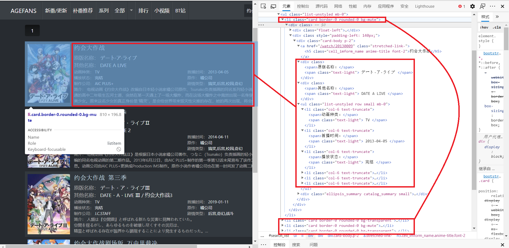
我们可以很清楚的看到，搜索到的视频信息就保存在 **\<li>...\</li>** 标签中，但是，对视频的描述信息全都在 **class="card-body p-2" 的 div** 标签中，所以我们首先要拿到所有的 **class="card-body p-2" 的 div** 标签 :

## 打印搜索到的信息

在打印信息时用 **Serial** 来顺序标注每个视频：由于**含有视频所有的信息的标签**全都被截取到了，所以在这里用 **BeautifulSoup4** 来解析所截取到的数据比之前的 **Xpath** 要**简洁**的多（至少在这里我时这么认为）。

```python
def print_info(url):  # 输出搜索到的视频信息
    html = request(url).text
    search_info = parsel.Selector(html).xpath('//*[@id="search_list"]/ul//div[@class="card-body p-2"]').extract()
    Serial = 0
    for info in search_info:
        Serial += 1  #标注视频
        soup = BeautifulSoup(info, 'html.parser')
        video_url[soup.a.h5.string] = 'http://agefans.org' + soup.a.attrs['href']
        print("{:0>2d}:\t《 ".format(Serial) + soup.a.h5.string + ' 》')
        for div in soup.find_all('div', {'class': ''}):
            print('\t' + div.span.string + div.span.next_sibling.next_sibling.string)
        num = 0
        for li in soup.find_all('li'):
            num += 1
            if num % 2 != 0:  # 优化打印界面
                print('\t' + li.span.string + li.span.next_sibling.next_sibling.string, end='')
            else:
                print('\t' + li.span.string + li.span.next_sibling.next_sibling.string)
        intro = soup.find('div', {'class': 'ellipsis_summary catalog_summary small'})
        print('\t' + intro.span.string + intro.span.next_sibling.next_sibling.string.replace('\n', '') + '...')
        print('\n' + '=' * 30 + '\n')
```

## BeautifelSoup4 库使用提醒

> **不过：这里有一点需要注意，**这也是我当初自学 **BeautifulSoup4** 库所**遗漏**的地方了：
> 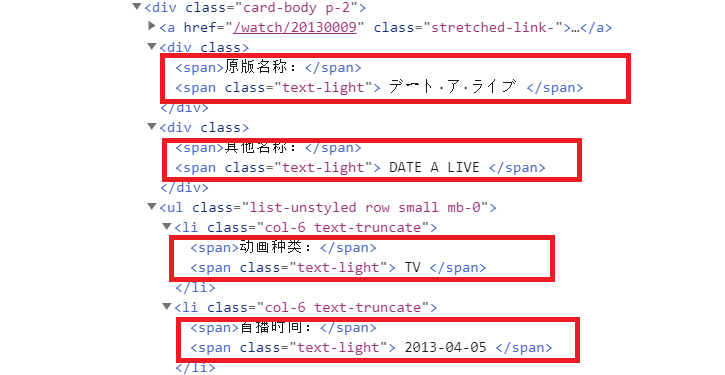
> 我们可以清楚的看到无论是保存在 **\<div>...\</div>** 还是在 **\<li>...\</li>** 标签中的信息，都由两个 **\<span>...\</span>** 标签包裹着。
> 所以在访问第一个 **\<span>...\</span>** 标签的文本：**div.span.string**
> 我们还知道访问下一个兄弟标签时使用： **当前标签.next_sibling**
> 然而在这里，当我们想要访问第二个 **\<span>...\</span>** 标签的文本时，并不是使用 **div.span.next_sibling.string** ，而是**div.span.next_sibling.next_sibling.string**。
> 至于为什么用两次 **.next_sibling** 呢？
> 这个问题在 **BeautifulSoup4** 库的 **[官网文档](https://beautifulsoup.readthedocs.io/zh_CN/v4.4.0/)** 中就已经给了我们答案了：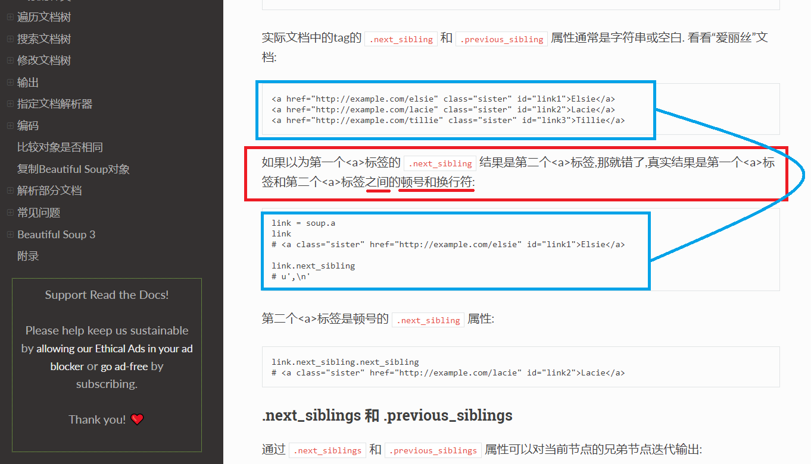

### 小优化

完成了信息的输出，一运行发现，居然有一个错误：
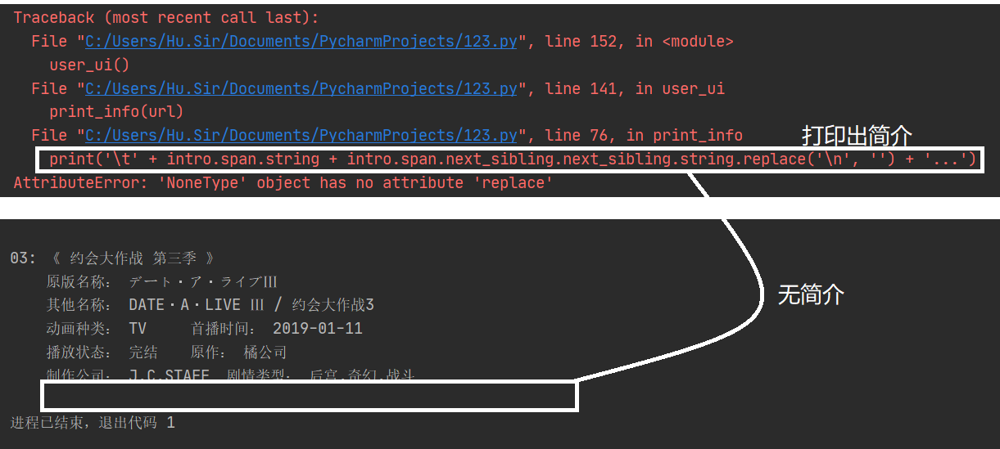
这是为什么呢？当我们打开浏览器实际操作时发现：
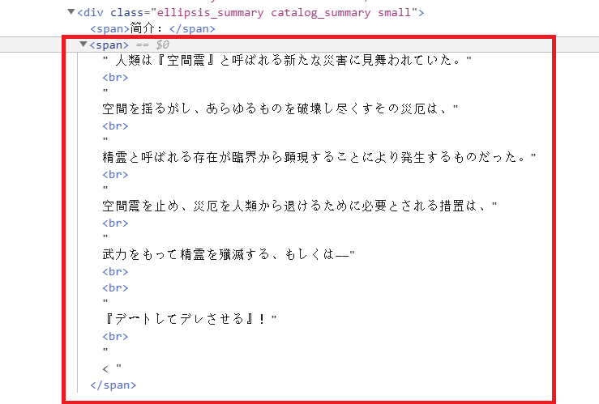
这个视频简介的第二个 **\<span>...\</span>** 标签的格式和之前的有所差别，我又找了几个类似的信息查看，觉得还是用简单粗暴的方法方便一点：
直接获取整个标签，将所有的**换行元素标签** **\<br/>** 给替换掉！

```python
#
#之前的代码全都不变
#
intro = soup.find('div', {'class': 'ellipsis_summary catalog_summary small'})
try:
    print('\t' + intro.span.string + intro.span.next_sibling.next_sibling.string.replace('\n', '') + '...')
except:
    content = str(intro.span.next_sibling.next_sibling).replace('\n', '').replace('<span>', '').replace('<br/>', '').replace('</span>', '').replace('&lt;', '') + '...'
    print('\t' + intro.span.string + content)
print('\n' + '=' * 30 + '\n')
```

## 链接解析

成功打印出了搜索到的所有视频信息后，现在开始分析发送的请求，用来提取视频的下载链接：

首先，该网站在视频打开后**不会直接加载第几集**，而是要我们选择，我们可以通过开发者工具可以获取到每一集的链接：
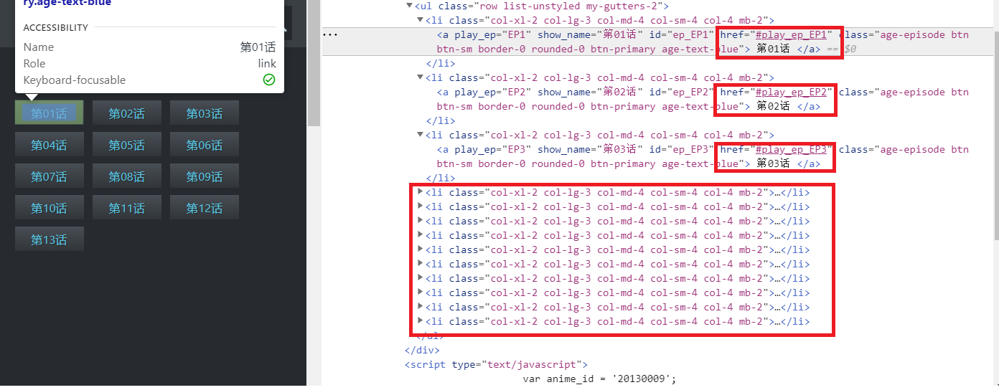
当我们点击某一集后，开发者工具会为我们捕获到如下的请求信息：
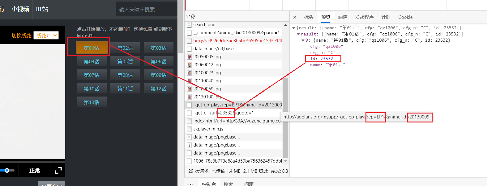
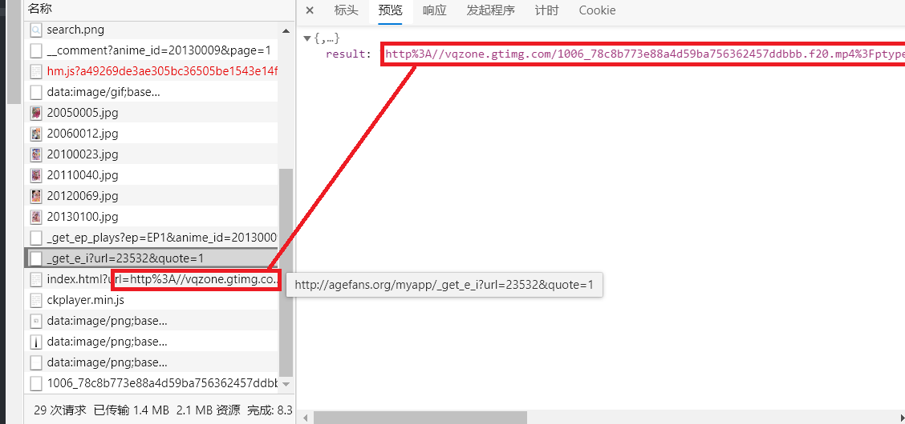
通过以上的两张图片，我们可以很清楚的发现这几条链接之间的关系，我试着将第二条请求返回的链接进行 **URL 解码** 发现：这就是视频的加载链接：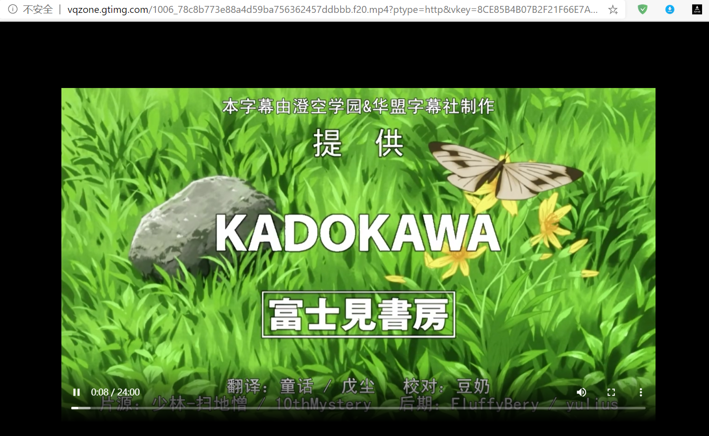

### 获取视频链接

这下就好办多了，下面开始编写获取视频链接的代码：
思路还是先通过 **Xpath** 获取所有的 **\<li>...\</li>** 标签，再用 **BeautifulSoup4** 来解析获取我们想要的东西：

```python
def get_relurl(name):
    global referer
    referer = video_url[name]
    html = request(video_url[name]).text
    time.sleep(random.random())
    all_li = parsel.Selector(html).xpath('//div[@id="plays_list"]/ul/li').extract()
    for info in tqdm(all_li, desc='正在获取视频链接：'):
        li = BeautifulSoup(info, 'html.parser')
        url = 'http://agefans.org/myapp/_get_ep_plays?{}&anime_id={}'.format(li.a.attrs['href'].split('_', 1)[-1].replace('_', '='), video_url[name].split('/')[-1])
        referer = video_url[name] + li.a.attrs['href']
        ID=request(url).json()['result'][0]['id']
        new_url = 'http://agefans.org/myapp/_get_e_i?url={}&quote=1'.format(ID)
        episodes_url[li.a.string.replace(' ', '')] = unquote(request(new_url).json()['result'])
```

### 小优化：

虽然在当前的视频看来，这样就已经能够满足我们的要求，但是，凡事都有例外！当我后期发现以下的情况的时候：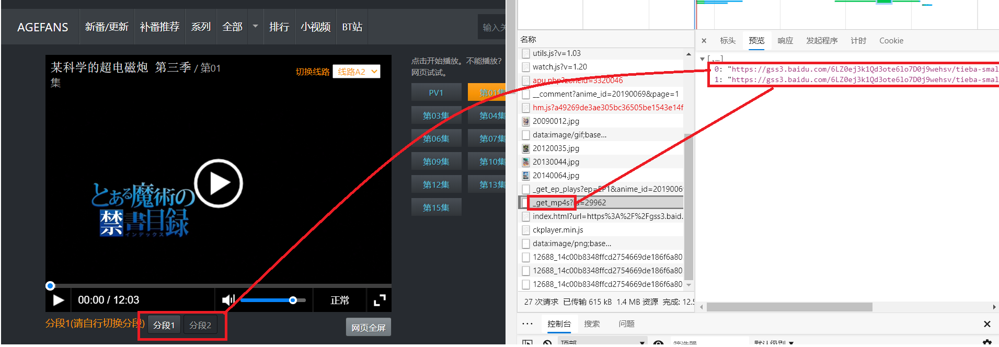
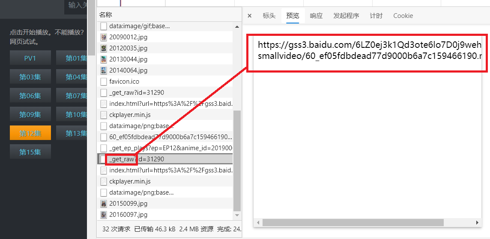
**总结：**

- 1、每一集的第二次请求又有**两种样式。**
- 2、同一个视频中**不同集数的返回数据有些是列表，有些又是直接返回的链接，** 所以我再次做了一点小改进：

```python
def get_relurl(name):
    global referer
    referer = video_url[name]
    html = request(video_url[name]).text
    time.sleep(random.random())
    all_li = parsel.Selector(html).xpath('//div[@id="plays_list"]/ul/li').extract()
    for info in tqdm(all_li, desc='正在获取视频链接：'):
        li = BeautifulSoup(info, 'html.parser')
        url = 'http://agefans.org/myapp/_get_ep_plays?{}&anime_id={}'.format(li.a.attrs['href'].split('_', 1)[-1].replace('_', '='), video_url[name].split('/')[-1])
        referer = video_url[name] + li.a.attrs['href']
        ID=request(url).json()['result'][0]['id']
        try:
            new_url = 'http://agefans.org/myapp/_get_e_i?url={}&quote=1'.format(ID)
            episodes_url[li.a.string.replace(' ', '')] = unquote(request(new_url).json()['result'])
        except:
            try:
                new_url = 'http://agefans.org/myapp/_get_mp4s?id={}'.format(ID)
                url_lists = request(new_url).json()
                if url_lists:
                    episodes_urls[li.a.string.replace(' ', '')] = url_lists
                else:
                    new_url = 'http://agefans.org/myapp/_get_raw?id={}'.format(ID)
                    episodes_urls.setdefault(li.a.string.replace(' ', ''), []).append(request(new_url).text)
                print(episodes_urls)
            except Exception as e:
                print(type(e), e)
```

### 提示

> 对 episodes_urls.setdefault(li.a.string.replace(' ', ''), []).append(request(new_url).text) 的解释：
> 1、**episodes_urls** ：一个**空字典。**
> 2、**li.a.string.replace(' ', '')** ：获取到的**集数名。**
> 3、**dict.setdefault(key, default=None)**
>
> > - **参数:** <br> **key** -- 查找的键值。
> >   **default** -- 键不存在时，设置的默认键值。
> > - **返回值:**
> >   如果字典中包含有给定键，则返回该键 **对应的值**，否则返回为该键 **设置的值。**
>
> 4、**episodes_urls.setdefault(key, []).append(value)** ：向 **episodes_urls** 字典中 **key** **对应的值**(已设置为 **列表** 类型)中追加值 **value**。

## 视频下载

到目前为止，已经成功获取了所有的视频链接，思路为判断获取到的视频链接中是否有列表，若==没有列表则直接遍历下载。== 若有列表则需要判断是否存在当前集数的视频，若存在则在集数后加上一个 **“1”** 。

> 1、**episodes_url** ：保存着没有分段的视频（无列表）。
> 2、**episodes_urls** ：保存着有分段的视频（有列表）。

```python
def video_download():
    global rel_path
    proxies = {'HTTP': random.choice(proxy)}
    if episodes_url:
        for name in tqdm(episodes_url, desc='正在下载: '):
            r = requests.get(episodes_url[name], proxies=proxies)
            with open(rel_path + '/' + name + '.mp4', 'wb') as f:
                f.write(r.content)
    else:
        for name in tqdm(episodes_urls, desc='正在下载: '):
            for epi_url in episodes_urls[name]:
                if os.path.exists(rel_path + '/' + name + '.mp4'):
                    r = requests.get(epi_url, proxies=proxies)
                    with open(rel_path + '/' + name + '1.mp4', 'wb') as f:
                        f.write(r.content)
                else:
                    r = requests.get(epi_url, proxies=proxies)
                    with open(rel_path + '/' + name + '.mp4', 'wb') as f:
                        f.write(r.content)
```

---

## 遗留问题

**问题描述**：在**有列表**的情况下，遍历下载时，起初我想用我之前写的一个方法(详情请见：[Python 爬虫用最普通的方法爬取 ts 文件并合成为 mp4 格式](https://blog.csdn.net/qq_44700693/article/details/106189511))，起初我的代码如下：改动的部分我用 **“#”** 隔出来了。

```python
def video_download():
    global rel_path
    if episodes_url:
        for name in tqdm(episodes_url, desc='正在下载: '):
            r = requests.get(episodes_url[name])
            with open(rel_path + '/' + name + '.mp4', 'wb') as f:
                f.write(r.content)
    else:
        for name in tqdm(episodes_urls, desc='正在下载: '):
            for epi_url in episodes_urls[name]:
                if os.path.exists(rel_path + '/' + name + '.mp4'):
                    r = requests.get(epi_url)
                    ##########################################################
                    with open(rel_path + '/' + name + '.mp4', 'ab') as f:
                    ##########################################################
                        f.write(r.content)
                else:
                    r = requests.get(epi_url)
                    with open(rel_path + '/' + name + '.mp4', 'wb') as f:
                        f.write(r.content)
```

但是这样到的结果是：视频的 **大小改变了**，但是播放时还是 **只有第一段视频的时间长度！** 到这里我就突然**迷茫**了~~~

---

## 参考代码

```python
import os
import time
import parsel
import random
import requests
from tqdm import tqdm
from bs4 import BeautifulSoup
from urllib.parse import unquote

referer = 'http://agefans.org/'
header = {
    'Cookie': '__cfduid=d9216f203c70cad8785fd8f10dcf2fb5d1594952490; csrftoken=OBJWjqkshWbI1IGirAjQqa9IKy9KOBp9T1a16N6GrA5qTcTdc4azooNitiumjxYA',
    'Host': 'agefans.org',
    'Referer': referer,
    'User-Agent': 'Mozilla/5.0 (Windows NT 10.0; Win64; x64) AppleWebKit/537.36 (KHTML, like Gecko) Chrome/84.0.4147.89 Safari/537.36 Edg/84.0.522.40'
}

path = './Spider'
video_url = {}  # 搜索到的视频信息
episodes_url = {}  # 视频下载地址
episodes_urls = {}  #分段视频链接

def request(url):
    proxies = {'HTTP': random.choice(proxy)}
    try:
        r = requests.get(url, headers=header,proxies=proxies)
        r.raise_for_status()
        r.encoding = 'utf-8'
        time.sleep(2)
        return r
    except Exception as e:
        print('request(url) : Error :' + str(type(e)) + ' : ' + str(e))

def print_info(url):  # 输出搜索到的视频信息
    html = request(url).text
    search_info = parsel.Selector(html).xpath('//*[@id="search_list"]/ul//div[@class="card-body p-2"]').extract()
    Serial = 0
    for info in search_info:
        Serial += 1
        soup = BeautifulSoup(info, 'html.parser')
        video_url[soup.a.h5.string] = 'http://agefans.org' + soup.a.attrs['href']
        print("{:0>2d}:\t《 ".format(Serial) + soup.a.h5.string + ' 》')
        for div in soup.find_all('div', {'class': ''}):
            print('\t' + div.span.string + div.span.next_sibling.next_sibling.string)
        num = 0
        for li in soup.find_all('li'):
            num += 1
            if num % 2 != 0:
                print('\t' + li.span.string + li.span.next_sibling.next_sibling.string, end='')
            else:
                print('\t' + li.span.string + li.span.next_sibling.next_sibling.string)
        intro = soup.find('div', {'class': 'ellipsis_summary catalog_summary small'})
        try:
            print('\t' + intro.span.string + intro.span.next_sibling.next_sibling.string.replace('\n', '') + '...')
        except:
            content = str(intro.span.next_sibling.next_sibling).replace('\n', '').replace('<span>', '').replace(
                '<br/>', '').replace('</span>', '').replace('&lt;', '') + '...'
            print('\t' + intro.span.string + content)
        print('\n' + '=' * 30 + '\n')

def get_relurl(name):
    global referer, rel_path
    rel_path = path + '/' + name
    if os.path.exists(rel_path):
        pass
    else:
        os.makedirs(rel_path)
    referer = video_url[name]
    html = request(video_url[name]).text
    time.sleep(random.random())
    all_li = parsel.Selector(html).xpath('//div[@id="plays_list"]/ul/li').extract()
    for info in tqdm(all_li, desc='正在获取视频链接：'):
        li = BeautifulSoup(info, 'html.parser')
        url = 'http://agefans.org/myapp/_get_ep_plays?{}&anime_id={}'.format(li.a.attrs['href'].split('_', 1)[-1].replace('_', '='), video_url[name].split('/')[-1])
        referer = video_url[name] + li.a.attrs['href']
        ID=request(url).json()['result'][0]['id']
        try:
            new_url = 'http://agefans.org/myapp/_get_e_i?url={}&quote=1'.format(ID)
            episodes_url[li.a.string.replace(' ', '')] = unquote(request(new_url).json()['result'])
        except:
            try:
                new_url = 'http://agefans.org/myapp/_get_mp4s?id={}'.format(ID)
                url_lists = request(new_url).json()
                if url_lists:
                    episodes_urls[li.a.string.replace(' ', '')] = url_lists
                else:
                    new_url = 'http://agefans.org/myapp/_get_raw?id={}'.format(ID)
                    episodes_urls.setdefault(li.a.string.replace(' ', ''), []).append(request(new_url).text)
                print(episodes_urls)
            except Exception as e:
                print(type(e), e)

def video_download():
    global rel_path
    proxies = {'HTTP': random.choice(proxy)}
    if episodes_url:
        for name in tqdm(episodes_url, desc='正在下载: '):
            r = requests.get(episodes_url[name], proxies=proxies)
            with open(rel_path + '/' + name + '.mp4', 'wb') as f:
                f.write(r.content)
    else:
        for name in tqdm(episodes_urls, desc='正在下载: '):
            for epi_url in episodes_urls[name]:
                if os.path.exists(rel_path + '/' + name + '.mp4'):
                    r = requests.get(epi_url, proxies=proxies)
                    with open(rel_path + '/' + name + '1.mp4', 'wb') as f:
                        f.write(r.content)
                else:
                    r = requests.get(epi_url, proxies=proxies)
                    with open(rel_path + '/' + name + '.mp4', 'wb') as f:
                        f.write(r.content)

def user_ui():
    print('#' * 25 + '\tAGE动漫离线助手\t' + '#' * 25)
    keyword = input('请输入搜索关键字：')
    url = 'http://agefans.org/search?q=' + keyword
    print_info(url)
    choice = int(input('请输入序号选择：'))
    name = list(video_url.keys())[choice - 1]
    start = time.time()
    get_relurl(name)
    video_download()
    end = time.time()
    print("下载完成！共耗时：{}".format(end - start))

if __name__ == '__main__':
    user_ui()
```

## 结果及下载情况

```bash
#########################	AGE动漫离线助手	#########################
请输入搜索关键字：约会
01:	《 约会大作战 》
	原版名称： デート·ア·ライブ
	其他名称： DATE A LIVE
	动画种类： TV 	首播时间： 2013-04-05
	播放状态： 完结 	原作： 橘公司
	制作公司： AIC PLUS+ 	剧情类型： 搞笑,后宫,校园,奇幻
	简介： 电视动画《约会大作战》改编自日本轻小说家橘公司原作、Tsunako负责插画的同名系列轻小说。故事是讲述一名普通的高中二年级生五河士道，突然在某一天遇上了一场大爆炸，而在这场大爆炸之中竟然出现一名身穿盔甲手持大剑的神秘美少女。原来这名少女的真正身份是“精灵”，是会给世界带来毁灭性灾难的存在，她的再次出现，将会给地球带来毁灭性的未来！然而主人公士道却有方法阻止世界毁灭，这个唯一能够阻止世界毁灭的方法 ...

==============================

02:	《 约会大作战 第二季 》
	原版名称： デート・ア・ライブⅡ
	其他名称： DATE A LIVE 2
	动画种类： TV 	首播时间： 2014-04-11
	播放状态： 完结 	原作： 橘公司
	制作公司： Production IMS 	剧情类型： 搞笑,后宫,校园,奇幻
	简介： 电视动画《约会大作战Ⅱ》是根据日本小说家橘公司著作、つなこ（Tsunako）负责插画的轻小说《约会大作战》改编的同名电视动画的第二期作品。2013年6月22日，由AIC PLUS+制作的第一季第12话末尾宣布了该作二期制作决定的消息。动画公司由AIC PLUS+更换成Production IMS制作。原作小说作者橘公司也在第一时间发了动画二期决定的推文。伴随着空间震荡、拥有毁灭世界力量的精灵。然 ...

==============================
#
#  为节省篇幅，省略一部分
#
==============================

请输入序号选择：1
正在获取视频链接：: 100%|██████████| 13/13 [01:57<00:00,  9.06s/it]
正在下载: 100%|██████████| 13/13 [02:39<00:00, 12.26s/it]
下载完成！共耗时：285.04985427856445

进程已结束，退出代码 0
```

下载结果拼接示例：


---

## 不知道是不是福利~

由于此次的示例没有任何第三方依赖工具，所以可以把这个示例发送到手机上，**随身下载，随时看片**：详情请见：[Pydroid 3 第三方库安装失败的解决方案](/skill/m3u8.md)
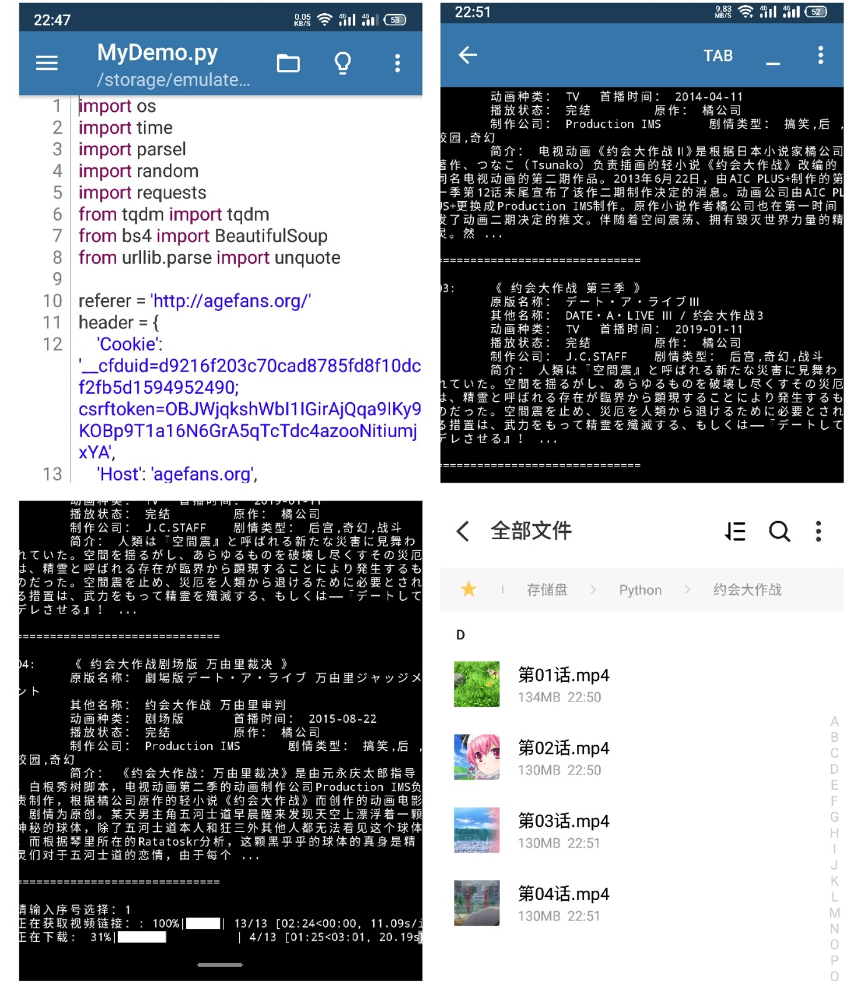
