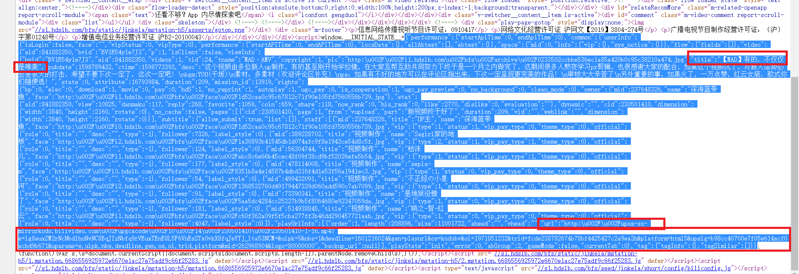
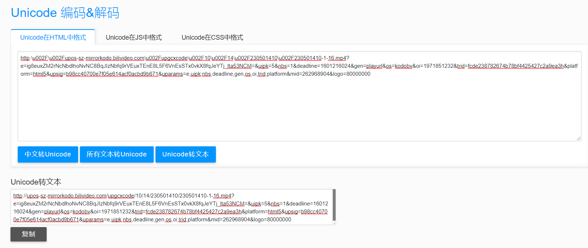
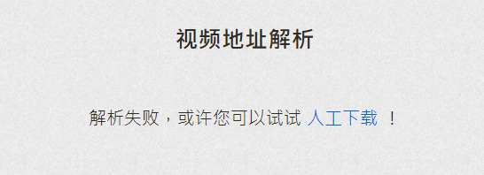
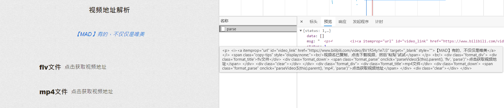
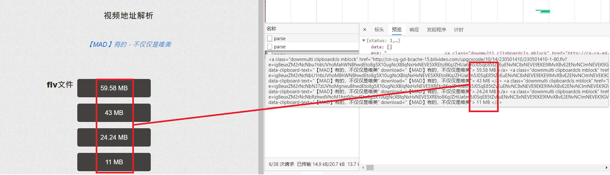
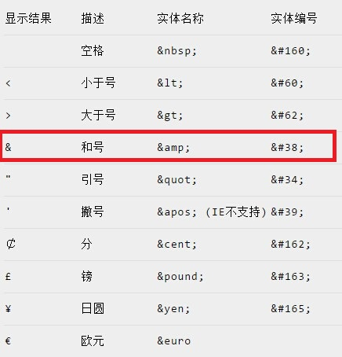
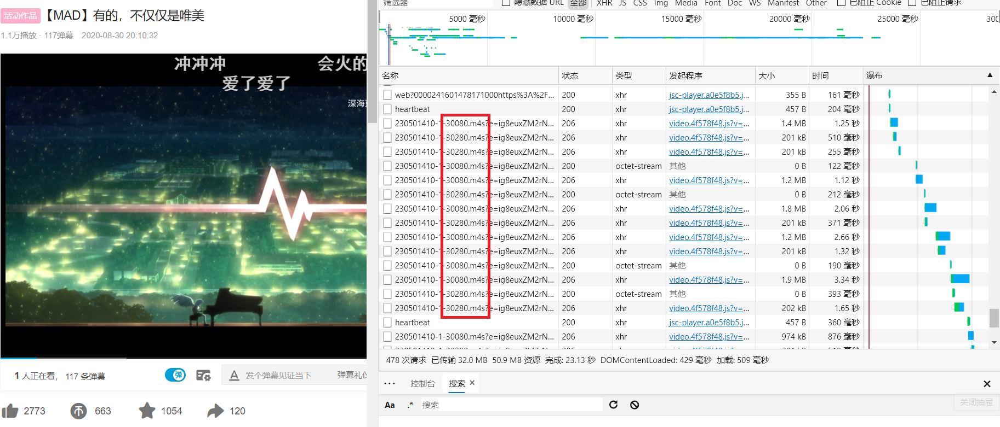
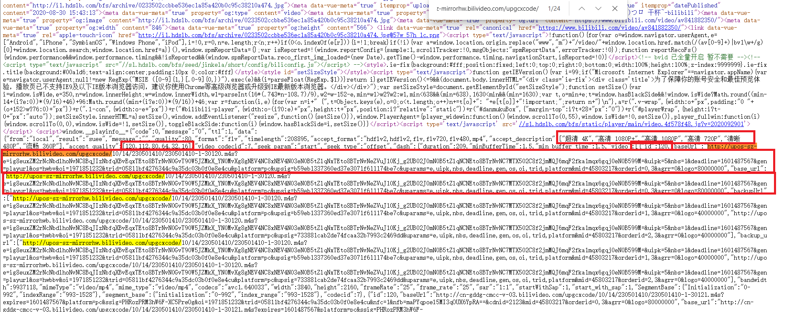
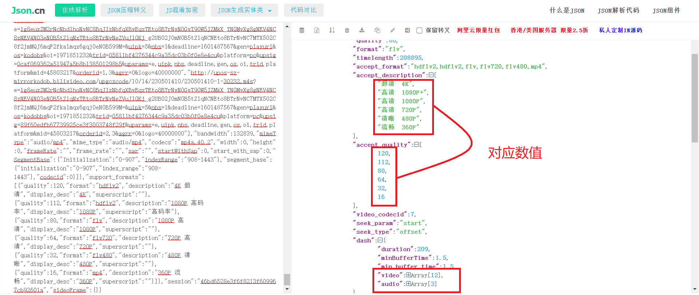

# 哔哩哔哩（bilibili）视频下载


## 导入

说起 B 站，肯定人人都知道吧，B 站的反扒机制并不是太严格，所以今天我准备给大家说说我能想到的几种方式，目前大概想到了三种方式：

- 1、模拟手机端请求，视频链接就添加在源码中。（**最简单**、但清晰度不好）
- 2、通过调用别人的接口来下载视频。（根据**接口的破解难度而定**，可选择清晰度，不过最高的清晰度仅为未登录时能观看的最大清晰度）
- 3、直接通过 B 站的网页版来抓取。（**难度稍大，不过清晰度很好，有大会员的话，能下载 4K 视频**）

那么接下来我就来依次给大家介绍介绍我的方法！

---

## 方法一：模拟手机端

为了方便分析，先拿一个链接作为测试：

> [https://www.bilibili.com/video/BV1R54y1e7J3](https://www.bilibili.com/video/BV1R54y1e7J3)

### 分析

既然方法一已经确定是模拟手机端的方式去请求，那么我们就直接开始分析：
对该链接进行抓包，找了半天，并没有找到什么有用的信息，所以我就直接去查看网页源码：

在仔细地查看源码后，就发现了如上所示的信息，视频的 **MP4** 链接和视频名就加载在源码之中。
因为这些信息都储存在 **\<script>...\</script>** 标签中，虽然能够将所有内容提取出来，再转换为 **JSON** 格式进行提取，但是这样的话就显得有些麻烦了，我们直接用正则表达式来提取：

### 参考代码

```python
class BiLiBiLi_phone():
    def __init__(self,s_url):
        self.url=s_url
        self.headers={
            'origin': 'https://m.bilibili.com',
            'referer': self.url,
            'user-agent': 'Mozilla/5.0 (Linux; Android 6.0; Nexus 5 Build/MRA58N)'
        }

    def bili_Download(self):
        r = requests.get(self.url, proxies=proxy, headers=self.headers)
        video_name=re.findall(',"title":"(.*?)","pubdate":', r.text)[0]
        if video_name == '':
            video_name = int(random.random() * 2 * 1000)
        if len(str(video_name)) > 20:
            video_name = video_name[:20]
        video_url = re.findall(',"url":"(.*?)","backup_url"', r.text)[0].encode('utf-8').decode('unicode_escape')
        r=requests.get(video_url,proxies=proxy,headers=self.headers)
        with open(path+video_name+'.mp4','wb')as f:
            f.write(r.content)
        print("【BiLiBiLi】: {} 下载完成！".format(video_name))
```

### 代码注解

- **video_url = re.findall(',"url":"(.\*?)","backup_url"', r.text)[0] .encode('utf-8').decode('unicode_escape')**

  > 从源码中提取的到的链接为：
  > http:**\u002F** **\u002F** upos-sz-mirrorkodo.bilivideo.com **\u002F** upgcxcode **\u002F** 10 **\u002F** 14 **\u002F** 230501410 **\u002F** 230501410-1-16.mp4?e=ig8euxZM2rNcNbdlhoNvNC8BqJIzNbfq9rVEuxTEnE8L5F6VnEsSTx0vkX8fqJeYTj_lta53NCM=&uipk=5&nbs=1&deadline=1601216024&gen=playurl&os=kodobv&oi=1971851232&trid=fcde238782674b78bf4425427c2a9ea3h&platform=html5&upsig=b98cc40700e7f05e614acf0acbd9b671&uparams=e,uipk,nbs,deadline,gen,os,oi,trid,platform&mid=262968904&logo=80000000
  > 链接中包含了大量的 **\u002F** 字段，这是因为源码中加载的是转换为 **Unicode** 编码后的链接，所以要进行编码转化。
  > 

## 方法二：第三方解析

为了方便分析，我还是拿之前的链接来作为测试：

> [https://www.bilibili.com/video/BV1R54y1e7J3](https://www.bilibili.com/video/BV1R54y1e7J3)

### 分析

对于方法二，我们首先需要找到一个第三方的网站来解析视频，然后将整个过程进行包装。
不同的网站有不同的解析方式，我这里只写出我随便选择的一个网站，清晰度就还行吧。

> 介于这个网站的特殊性：当输入链接为：
> **https://www.bilibili.com/video/BV1R54y1e7J3?spm_id_from=333.5.b_646f7567615f6d6164.4** 时会出现以下报错
> 
> 所以需要将后面的部分信息去掉！

将准备好的链接放到解析网站可以得到以下信息：

由于网站的特殊性，若选取 **MP4 文件** ，有时会出现视频分成多个的情况，所以我在这里主要选取 **FLV 文件** 。

我们可以很清楚的看到，该接口返回的内容中，是一些属于 **HTML 标签** 的信息，在这里不编写清晰度选择的代码，有需要的可以自行编写，直接选取清晰度最好的一个来解析。

### 参考代码

这是为了防止这个视频解析服务网站被滥用。在这里我对该解析网站进行了隐藏，想要使用这个解析服务的地址，可以私信我。
这种解析网站的一种特点就是，知道的人越多，它失效的也就越快。
希望这样，它可以尽量活得久一点点。

```python
class BiLiBiLi_api():
    def __init__(self, s_url):
        self.url = s_url.split('?')[0]
        self.header1 = {
            'Host': 'www.****.com',
            'Origin': 'http://www.****.com',
            'Referer': quote('http://www.****.com/video?url={}&page=video&submit=视频下载'.format(self.url)),
            'User-Agent': 'Mozilla/5.0 (Windows NT 10.0; Win64; x64) AppleWebKit/537.36 (KHTML, like Gecko) Chrome/85.0.4183.121 Safari/537.36 Edg/85.0.564.63'
        }
        self.data = {
            'url': self.url,
            'format': 'flv',
            'from': 'parse',
            'retry': '1'
        }
        self.header2 = {
            'origin': 'https://www.bilibili.com/',
            'referer': self.url,
            'user-agent': 'Mozilla/5.0 (Windows NT 10.0; Win64; x64) AppleWebKit/537.36 (KHTML, like Gecko) Chrome/85.0.4183.121 Safari/537.36 Edg/85.0.564.63'
        }

    def BL_api_Download(self):
        r = requests.post('http://www.****.com/parse', proxies=proxy, data=self.data, headers=self.header1)
        video_name = re.findall('data-clipboard-text="(.*?)"', r.json()['msg'])[0]
        video_url = re.findall('href="(.*?)"', r.json()['msg'])[0].replace('amp;', '')
        r1 = requests.get(video_url, proxies=proxy, headers=self.header2)
        with open(path + video_name + '.flv', 'wb')as f:
            f.write(r1.content)
        print("【BiLiBiLi】: {} 下载完成！".format(video_name))
```

### 代码注解

- 初始化中为什么含有两个请求头信息。
  1、**header1** 的请求头信息为解析网站时所需要的一些信息。
  2、**header2** 的请求头信息为下载视频时所需要的一些信息。
  > **请求头为什么要分开写成两个：**
  > 第一个请求头所需的信息就不用多说，都是常规操作。第二个请求头所需是信息时因为该网站所解析出的视频链接为 B 站中的原链接，所以要带上关于 B 站信息的请求头来进行下载，否则服务器将会 **拒绝** 我们访问。
- **data 数据是什么：**

  > 在上述解析网站的操作过程中我们还记得，在请求完解析链接后，仍然需要选择视频文件的格式，我们才能得到视频的链接，而当我们选择完格式以后，会再次对原链接进行请求，并且会携带上固定格式的 data 数据。

- quote('http://www.\*\*\**.com/video?url={}&page=video&submit=视频下载'.format(self.url))
  > **为什么要进行编码转换：**
  > 网站就是这样，不更换编码，它要报错，嘿嘿嘿。
- **video_url = re.findall('href="(.\*?)"', r.json()['msg'])[0] .replace('amp;', '')**
  > 同之前所说的，未标黄的部分也还是基本操作，就是利用正则表达式来提取信息，而对于所标黄的部分，这是因为所解析到的链接中含有 HTML 的转移字符：
  > http://cn-cq-gd-bcache-15.bilivideo.com/upgcxcode/10/14/230501410/230501410-1-80.flv?e=ig8euxZM2rNcNbu1hbUVhoMahWNBhwdEto8g5X10ugNcXBlqNxHxNEVE5XREto8KqJZHUa6m5J0SqE85tZvEuENvNC8xNEVE9EKE9IMvXBvE2ENvNCImNEVEK9GVqJIwqa80WXIekXRE9IMvXBvEuENvNCImNEVEua6m2jIxux0CkF6s2JZv5x0DQJZY2F8SkXKE9IB5QK \&amp; deadline=1601220310 \&amp; gen=playurl \&amp; nbs=1 \&amp; oi=1696943910 \&amp; os=bcache \&amp; platform=pc \&amp; trid=380e02a6015c4f6c89df5944e35a87a8 \&amp; uipk=5 \&amp; upsig=062c2af07c4454f8641dc7552b1c1f3e \&amp; uparams=e,deadline,gen,nbs,oi,os,platform,trid,uipk \&amp; mid=0
  > 

## 方法三：原网站爬取

对于方法三，既然选择直接去官网直接爬取，就需要分析网站的请求信息：
我们依然拿之前的链接来做测试：

> [https://www.bilibili.com/video/BV1R54y1e7J3](https://www.bilibili.com/video/BV1R54y1e7J3)

### 分析与主要代码:

打开网页进行抓包可以看到，对于视频播放时的数据请求为两种形式：


- 1、**...230501410-1-30080.m4s?...**
- 2、**...230501410-1-30280.m4s?...**

这种情况也很常见，网站将音频和视频分隔开，分别进行请求得到我们所看到的视频。
**但是**！要怎么分辨谁是谁呢？
我们都知道视频所占字节比音频多，所以答案就是 **谁大谁就是视频的请求链接** 。我们对两个链接先进行尝试性的请求：

```python
import requests

path = './Spider'

url='https://upos-sz-mirrorhw.bilivideo.com/upgcxcode/10/14/230501410/230501410-1-30280.m4s?e=ig8euxZM2rNcNbdlhoNvNC8BqJIzNbfqXBvEqxTEto8BTrNvN0GvT90W5JZMkX_YN0MvXg8gNEV4NC8xNEV4N03eN0B5tZlqNxTEto8BTrNvNeZVuJ10Kj_g2UB02J0mN0B5tZlqNCNEto8BTrNvNC7MTX502C8f2jmMQJ6mqF2fka1mqx6gqj0eN0B599M=&uipk=5&nbs=1&deadline=1601485367&gen=playurl&os=hwbv&oi=1971851232&trid=e3eae34ab9ba4a579931f56205e7e749u&platform=pc&upsig=0ae578040544b08da62d89e843ff92be&uparams=e,uipk,nbs,deadline,gen,os,oi,trid,platform&mid=45803217&orderid=0,3&agrr=0&logo=80000000'

headers={
    'origin': 'https://www.bilibili.com/',
    'range': 'bytes=0-1198620',
    'referer': 'https://www.bilibili.com/video/BV1R54y1e7J3',
    'user-agent': 'Mozilla/5.0 (Windows NT 10.0; Win64; x64) AppleWebKit/537.36 (KHTML, like Gecko) Chrome/85.0.4183.121 Safari/537.36 Edg/85.0.564.63'
}

r=requests.get(url,headers=headers)
with open(path+"123.flv","wb")as f:
  f.write(r.content)
```

经过反复的尝试我发现请求头中的 **range** 参数是必不可少的，当前请求的 **range** 的范围为**998814-1198620**，但是因为只下载中间的片段，播放器不能识别出编码格式并解码，所以我将首位置修改成了 **0**。
实验证明我们的确能够得出这两个请求链接**一个为音频一个为视频**，并且链接具有时效性。

> 至于音频和视频的格式都设为 flv ,当该链接为音频时播放是没有画面的。

而如果想要下载整个视频或整个音频， **range** 的右值怎么设置呢？
方法有多种，我再这里把我能够想到的写出来：

- 1、先用一个小范围的 **range** 来请求链接，可以从返回的信息中的 **Content-Length**字段得到下一次的请求范围。然后一直发送不同大小的请求，直到请求完成。
- 2、直接将 **range** 的范围定为 0-一个足够大的数，怎样才算足够大呢？**只要大于或等于视频或音频的字节数就好。**
- 3、这第三种就是我要使用的一种，因为它特别简单：直接将 **range** 的范围定为 0-（注意是数字 0 和一个 - ），则链接就会返回从 0 开始到结束时的数据。

> 如果还有什么新的方法，欢迎留言分享！

**但是**！就算知道了谁是谁，怎么请求，请求的链接又从哪里来呢？
我翻遍了请求链接都没有找到有用的信息，直到我查看到网页的源码：

通过链接的部分信息我找到了在源码中一些链接，可以大致看出链接及信息储存在 **JSON** 数据，我们将它格式化后得到以下页面：

为了后期方面添加选择清晰度的功能，所以这里我会通过对 JSON 数据
的操作来获取数据，对应着最高清晰度，我们直接获取 **video 字段** 中的第一条链接，也就是当前的最高清晰度：

### 参考代码

```python
class BiLiBiLi():
    def __init__(self, s_url):
        self.url = s_url
        self.header = {
            'Range': 'bytes=0-',
            'referer': self.url,
            'origin': 'https://www.bilibili.com/',
            # 'cookie':'填写自己的B站大会员cookie',
            'user-agent': 'Mozilla/5.0 (Windows NT 10.0; Win64; x64) AppleWebKit/537.36 (KHTML, like Gecko) Chrome/85.0.4183.121 Safari/537.36 Edg/85.0.564.63'
        }

    def BL_download(self):
        html = requests.get(self.url, headers=self.header).text
        json_data = re.findall('window.__playinfo__=(.*?)</script>', html)[0]
        video_name=re.findall(',"title":"(.*?)","', html)[0]
        if video_name == '':
            video_name = int(random.random() * 2 * 1000)
        if len(str(video_name)) > 20:
            video_name = video_name[:20]
        video = json.loads(json_data)['data']['dash']['video'][0]['baseUrl']
        self.download(video,path+video_name+'.flv')
        print("【BiLiBiLi】: {} 视频下载完成！".format(video_name))
        audio = json.loads(json_data)['data']['dash']['audio'][0]['baseUrl']
        self.download(audio, path + video_name + '.mp3')
        print("【BiLiBiLi】: {} 音频下载完成！".format(video_name))

    def download(self,url,rel_path):
        r = requests.get(url, headers=self.header)
        with open(rel_path, 'wb')as f:
            f.write(r.content)
```

如果你有**B 站大会员**的话，可以填写自己的 **cookie** ，支持下载 **4K** 视频。亲测有效！！！

## 全部源码

```python
import random
import re
from urllib.parse import quote

import requests

url = 'https://ip.jiangxianli.com/api/proxy_ip'
r = requests.get(url)
proxy = {'HTTP': 'http://' + r.json()['data']['ip'] + ':' + r.json()['data']['port']}
print(proxy)
path = './Spider/'

class BiLiBiLi_phone():
    def __init__(self, s_url):
        self.url = s_url
        self.headers = {
            'origin': 'https://m.bilibili.com',
            'referer': self.url,
            'user-agent': 'Mozilla/5.0 (Linux; Android 6.0; Nexus 5 Build/MRA58N)'
        }

    def bili_Download(self):
        r = requests.get(self.url, proxies=proxy, headers=self.headers)
        video_name = re.findall(',"title":"(.*?)","pubdate":', r.text)[0]
        if video_name == '':
            video_name = int(random.random() * 2 * 1000)
        if len(str(video_name)) > 20:
            video_name = video_name[:20]
        video_url = re.findall(',"url":"(.*?)","backup_url"', r.text)[0].encode('utf-8').decode('unicode_escape')
        r = requests.get(video_url, proxies=proxy, headers=self.headers)
        with open(path + video_name + '.mp4', 'wb')as f:
            f.write(r.content)
        print("【BiLiBiLi】: {} 下载完成！".format(video_name))

class BiLiBiLi_api():
    def __init__(self, s_url):
        self.url = s_url.split('?')[0]
        self.header1 = {
            'Host': 'www.****.com',
            'Origin': 'http://www.****.com',
            'Referer': quote('http://www.****.com/video?url={}&page=video&submit=视频下载'.format(self.url)),
            'User-Agent': 'Mozilla/5.0 (Windows NT 10.0; Win64; x64) AppleWebKit/537.36 (KHTML, like Gecko) Chrome/85.0.4183.121 Safari/537.36 Edg/85.0.564.63'
        }
        self.data = {
            'url': self.url,
            'format': 'flv',
            'from': 'parse',
            'retry': '1'
        }
        self.header2 = {
            'origin': 'https://www.bilibili.com/',
            'referer': self.url,
            'user-agent': 'Mozilla/5.0 (Windows NT 10.0; Win64; x64) AppleWebKit/537.36 (KHTML, like Gecko) Chrome/85.0.4183.121 Safari/537.36 Edg/85.0.564.63'
        }

    def BL_api_Download(self):
        r = requests.post('http://www.****.com/parse', proxies=proxy, data=self.data, headers=self.header1)
        video_name = re.findall('data-clipboard-text="(.*?)"', r.json()['msg'])[0]
        video_url = re.findall('href="(.*?)"', r.json()['msg'])[0].replace('amp;', '')
        r1 = requests.get(video_url, proxies=proxy, headers=self.header2)
        with open(path + video_name + '.flv', 'wb')as f:
            f.write(r1.content)
        print("【BiLiBiLi】: {} 下载完成！".format(video_name))

class BiLiBiLi():
    def __init__(self, s_url):
        self.url = s_url
        self.header = {
            'Range': 'bytes=0-',
            'referer': self.url,
            'origin': 'https://www.bilibili.com/',
            # 'cookie':'填写自己的B站大会员cookie',
            'user-agent': 'Mozilla/5.0 (Windows NT 10.0; Win64; x64) AppleWebKit/537.36 (KHTML, like Gecko) Chrome/85.0.4183.121 Safari/537.36 Edg/85.0.564.63'
        }

    def BL_download(self):
        html = requests.get(self.url, headers=self.header).text
        json_data = re.findall('window.__playinfo__=(.*?)</script>', html)[0]
        video_name=re.findall(',"title":"(.*?)","', html)[0]
        if video_name == '':
            video_name = int(random.random() * 2 * 1000)
        if len(str(video_name)) > 20:
            video_name = video_name[:20]
        video = json.loads(json_data)['data']['dash']['video'][0]['baseUrl']
        self.download(video,path+video_name+'.flv')
        print("【BiLiBiLi】: {} 视频下载完成！".format(video_name))
        audio = json.loads(json_data)['data']['dash']['audio'][0]['baseUrl']
        self.download(audio, path + video_name + '.mp3')
        print("【BiLiBiLi】: {} 音频下载完成！".format(video_name))

    def download(self,url,rel_path):
        r = requests.get(url, headers=self.header)
        with open(rel_path, 'wb')as f:
            f.write(r.content)

def user_ui():
    print('*' * 10 + '\t BiLiBiLi视频下载\t' + '*' * 10)
    print('*' * 5 + "\t\tAuthor:  高智商白痴\t\t" + '*' * 5)
    share_url = input('请输入分享链接: ')
    choice = int(input("1、模拟手机端下载  2、调用接口下载  3、直接下载\n选择下载方式："))
    if choice == 1:
        BiLiBiLi_phone(share_url).bili_Download()
    if choice == 2:
        BiLiBiLi_api(share_url).BL_api_Download()
    if choice == 3:
        BiLiBiLi(share_url).BL_download()

if __name__ == '__main__':
    user_ui()
```

## BIG 福利

虽然这篇博客还没有写完，不过我已经迫不及待的给大家分享我在寻找资源的过程中发现的好多西：**B 站的壁纸**
其实 B 站有一个官方号，上面全是一些 2233 娘的一些壁纸，嘿嘿嘿~
话不多说，链接奉上：[壁纸娘](https://space.bilibili.com/6823116/album)
这里面全是高清大图。当然我也给大家准备了一个官方接口（貌似好像是官方的），也是我在找资源的过程中发现的，其实，这个接口能够让我们很方便的调用并下载壁纸：[https://api.vc.bilibili.com/link_draw/v1/doc/doc_list?uid=6823116&page_num=0&page_size=500&biz=all](https://api.vc.bilibili.com/link_draw/v1/doc/doc_list?uid=6823116&page_num=0&page_size=500&biz=all)
