{docsify-updated}

# 片库视频下载


---

## 导入

当我们在写爬虫实例时，就肯定会对每个网页的链接进行分析，然后才能模拟请求。就 **目前而言** ，根据我的 **不完全统计** 显示。有以下三种情况：

> 1. 在浏览器地址栏显示域名加搜索的关键字（和其他参数）：
>    https://www.*****.tv/tv/wNiNmMnRjZ.html?q=传闻中的陈芊芊
> 2. 在浏览器地址栏显示域名和加密后的搜索关键字（和其他参数）：
>    https://www.*****.tv/tv/wNiNmMnRjZ.html?q=%E4%BC%A0%E9%97%BB%E4%B8%AD%E7%9A%84%E9%99%88%E8%8A%8A%E8%8A%8A
> 3. 在浏览器地址栏显示的是经过网站处理过的链接。其实这种处理并不是特别麻烦，只要你知道是怎么处理的。

> [!TIP]
> 其实这第一种和第二种也可以说成为是一种情况，因为 URL 加密是浏览器自动加密的。在模拟请求时不需要做任何处理。

---

## 分析

老规矩，直接从**搜索影片**入手：当我以 **传闻中** 为关键词搜索时：情况如下：
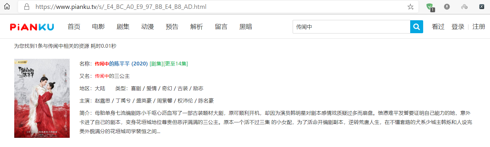
浏览器地址栏中的地址一看就知道，这并不仅仅是 **URL 加密** 。可是这又是怎么处理的呢？看了源码中的几个 **JS** 脚本，一直都没有找到关键信息。后来发现：这里的地址和 **加密后的 URL** 有关。如下：（忽略后缀)

> **伪原链接：** https://www.****.tv/tv/wNiNmMnRjZ.html?q=传闻中 <br> **URL 加密：** https://www.****.tv/tv/wNiNmMnRjZ.html?q=%E4%BC%A0%E9%97%BB%E4%B8%AD <br> **此处链接：** https://www.****.tv/tv/wNiNmMnRjZ.html?q=_E4_BC_A0_E9_97_BB_E4_B8_AD

你看出来了吗？没错此处的链接是将加密后的 URL 链接中的 “ **%** ” 更换为 “ \_ ” ，最后再加上 “ **.html** ” 的后缀。
解决了这个问题，我们就来开始写请求：

```python
from urllib.parse import quote

def user_ui():
    print('***********************************************************')
    keyword = '传闻中'  # input('请输入搜索的视频关键字：')
    url = 'https://www.****.tv/s/go.php?q=' + quote(keyword, 'utf-8')  # 进行url加密
    URL = (url.split('go.php?q=')[0] + url.split('go.php?q=')[1]).replace('%', '_') + '.html'
     # 根据网页情况，更改加密后的url
    print(URL)

user_ui
```

输出：

```
https://www.****.tv/s/_E4_BC_A0_E9_97_BB_E4_B8_AD.html
```

> [!TIP]
> 导入**from urllib.parse import quote** 库，以便于我们手动加密原 URL。

由于整个运行过程中需要多次发送请求，所以，为减少代码量，直接写一个请求函数：

```python
import requests

referer = 'https://www.****.tv'
header = {
    'referer': referer,
    'user-agent': 'Mozilla/5.0 (Windows NT 10.0; Win64; x64) AppleWebKit/537.36 (KHTML, like Gecko) Chrome/83.0.4103.61 Safari/537.36 Edg/83.0.478.37'
}

def requests_url(url):  # 请求网址
    try:
        r = requests.get(url, headers=header)
        r.raise_for_status()
        r.encoding = 'UTF-8'
        return r
    except:
        print("*********请求失败！***********")
```

**经过以上处理后**，我们已经获得了搜索的正确链接和请求函数。接下来我们开始根据源码来提取出我们所需要的各种视频信息，保存在 **videos_info** 中：
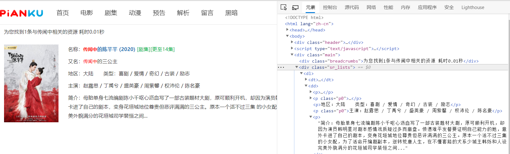
开始提取数据：

```python
  html = requests_url(URL).text # 请求网页
  # 搜索时间以及数量
    search_time = parsel.Selector(html).xpath('//div[@class="breadcrumbs"]/text()').extract()[0]
    # 视频信息标签
    videos_info = parsel.Selector(html).xpath('//dd').extract()
    print(search_time)
    print(videos_info)
```

> 本次以 **传闻中** 作为关键词搜索时只搜索到了 **1** 条记录。但是如果以后搜索的记录很多的话，就需要翻页了，所以后期我在这里做了一点小改进：

```python
  html = requests_url(URL).text
  # 搜索时间以及数量
    search_time = parsel.Selector(html).xpath('//div[@class="breadcrumbs"]/text()').extract()[0]
    # 视频信息标签
    videos_info = parsel.Selector(html).xpath('//dd').extract()
    try:  # 若搜索结果小于10项，则无页码信息
        print(search_time, end='')
        # 页码
        page_num = parsel.Selector(html).xpath('//div[@class="pages"]/a/text()').extract()[-2]
        print('，共{}页。每页10项。'.format(page_num))
    except:
        print(end='\n')
```

> [!TIP]
> 为什么要用 **try...except** 呢？那是因为当搜索的结果每一页显示 **10** 条记录。而当结果小于 **10** 条时，源码中并没有出现显示页码的标签。

现在，我们已经获取了搜索页面的**所有视频的信息标签**（此时只有一条），接下来就开始提取关键信息：


- 由 \<em>...\</em> 标签包裹起来的文字在网页中显示为红色字体，即我们搜索的关键字。但是我们并不关心谁是关键字，所以用 **replace** 去掉此标签。 之后用 **BeautifulSoup** 进行解析提取，并将提取的视频名与拼接后的链接保存到 **video** 中。

> [!TIP] **videos_info** 中储存的是搜索的所有记录，而 **video_info** 中是某一条记录。

```python
def split_info(videos_info):
    num = 1
    for video_info in videos_info:
     # 去掉关键字高亮标签
        info = str(video_info).replace('<em>', '').replace('</em>', '')  # 去掉源码中红色字体的标注
        soup = BeautifulSoup(info, 'html.parser')
        info = soup.find_all('p')
        # 将通过关键字搜索到的视频名与对应链接保存下来
        # 对应链接为拼接后的完整链接，如：https://www.*****.tv/tv/wNiNmMnRjZ.html
        video[info[0].strong.a.string + info[0].span.string] = 'https://www.pianku.tv' + info[0].strong.a.attrs['href']
        name2_info = info[1].string  # 又名
        area_info = info[2].string  # 地区与类型
        actor_info = info[3].string  # 演员
        introduction = info[4].string  # 简介
        print('***********************************************************')
        print('{:0>2d}: '.format(num), end='')
        num += 1
        print('\t' + info[0].strong.a.string + info[0].span.string)  # 名称
        print('\t' + name2_info)
        print('\t' + area_info)
        print('\t' + actor_info)
        print('\t' + introduction)
```

**运行结果：**
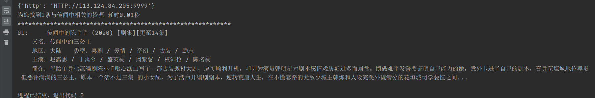

**接下来：** 要处理的是：根据前面的序号来选择下载的视频：
怎么样根据序号来选择呢？

- 我们之前已经将视频的名字与拼接后的链接保存到了 **video 字典** 中。那么我们就可以通过视频的**名字**来访问该视频的链接。
- 那么问题又来了，怎样通过**序号**来确定视频的名字呢？这首先啊，必须先通过 **.keys()** 来取出所有的名字，接着强转为 **list** 类型。这样的话不就可以通过**下标**来访问了咩。

```python
 choice = input('\n请输入序号选择：')
    NAME = list(video.keys())[int(choice) - 1]  # 通过下标确定进一步搜索的类容
    URL = video[NAME]
```

> 通过 **input** 输入的数据为字符串类型，需强转为 **int** 类型。

当我们选择好要下载视频时，就可以通过**名字**来获取视频的主页链接，之后就可以请求具体的视频链接了：
**如下图**：我们通过控制台的**预览**可以发现，请求当前的网址获得的并不是我们所需要的！

- 但是啊，我们发现，按照原链接爬取的网页源码之中，没有任何与播放集数有关的数据，难道是 **动态加载**？

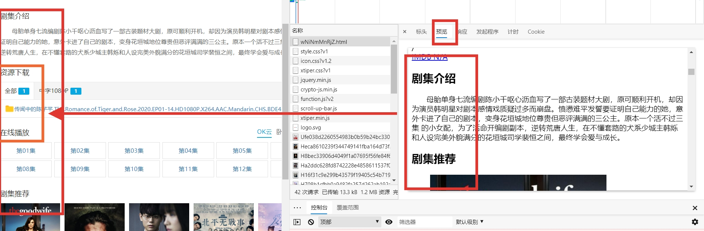
既然当前网页中有**资源下载**与**在线播放**的链接，那么久肯定存在与某一次的请求中。
终于，在所有的请求里面找到了数据来源：
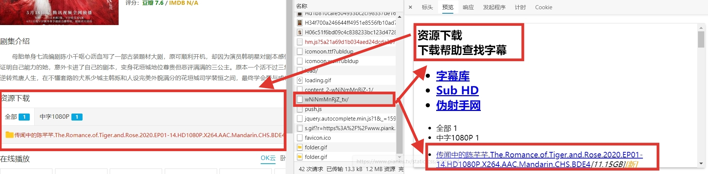
于是我们就拿到了下载的请求链接：[https://www.\*\*\*\*.tv/ajax/downurl/wNiNmMnRjZ_tv](https://www.****.tv/ajax/downurl/wNiNmMnRjZ_tv)

为了更方便的来**理解并构造**新的请求链接：我去查看了一下其他类型的链接，又发现了以下的几种情况：

> **剧集：** https://www.****.tv/tv/wNiNmMnRjZ.html （原链接）<br> > https://www.****.tv/ajax/downurl/wNiNmMnRjZ_tv/ （播放链接）<br> > **电影：** https://www.****.tv/mv/wNjNWYyATY.html （原链接）<br> > https://www.****.tv/ajax/downurl/wNjNWYyATY_mv/ （播放链接）<br> > **动漫：** https://www.****.tv/ac/wNiFjMnNmM.html （原链接）<br> > https://www.****.tv/ajax/downurl/wNiFjMnNmM_ac/ （播放链接）<br>

```python
def get_video(url):
    # 正确的链接拼接
    URL = 'https://www.****.tv/ajax/downurl/' + url.split('/')[-1].split('.')[0] + '_'+url.split('/')[3]+'/'  # 根据重定向拼接真实的链接
```

> [!TIP]
> 下载链接最后的 “ **/** ” ，是必须要加上的，没有的话，依然会加载不出来。

乍一看这个链接，链接中包含 **ajax** 的字样，我立马就想到了 **JSON** 数据的处理。但是却一直在报错。
结果白白浪费了那几分钟，又回到刚刚分析的地方，查看了网页的 **响应** 部分，结果：
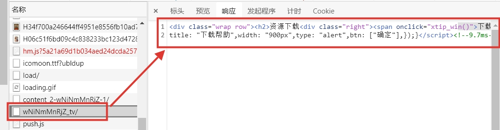
返回的并不是 JSON 数据，而是一段 HTML 标签。
我写了个小例子来格式化这段代码：

```python
import requests
from bs4 import BeautifulSoup
url='https://www.****.tv/ajax/downurl/wNiNmMnRjZ_tv/'
header = {
    'referer': 'https://www.****.tv',
    'user-agent': 'Mozilla/5.0 (Windows NT 10.0; Win64; x64) AppleWebKit/537.36 (KHTML, like Gecko) Chrome/83.0.4103.61 Safari/537.36 Edg/83.0.478.37'
}
r = requests.get(url,  headers=header)
soup=BeautifulSoup(r.text,'html.parser')
print(soup.prettify())
```

结果如下：

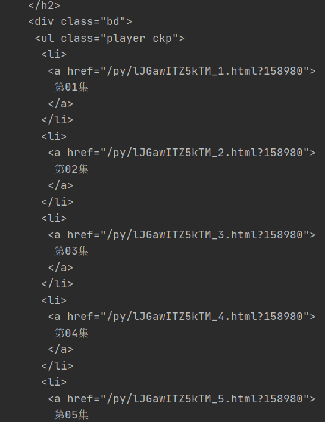

然后再来重新写这段代码：

```python
def get_video(url):
    # 根据重定向拼接真实的链接
    URL = 'https://www.****.tv/ajax/downurl/' + url.split('/')[-1].split('.')[0] + '_'+url.split('/')[3]+'/'
    # 请求视频链接
    response = requests_url(URL)
    # 找到第一集的播放链接
    soup = BeautifulSoup(response.text, 'html.parser').find('ul', attrs={'class': "player ckp"}).find('li').a.attrs['href']
    # 重新拼接每一集主页链接
    URL1 = 'https://www.****.tv' + soup
```

知道了如何请求播放链接，就以第一集来作为例子进行分析：
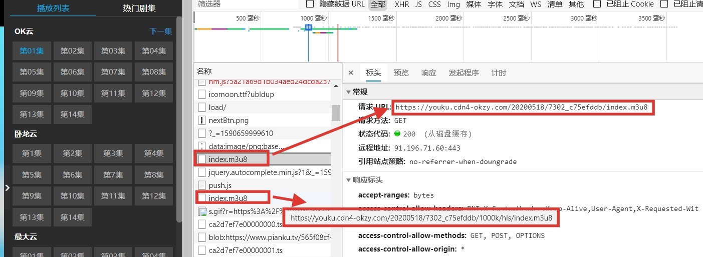
在第一集的播放页面中，捕获到了两个 **index.m3u8** 的文件，我们知道这是视频的一种格式。由多个 **[ts 文件](https://baike.baidu.com/item/TS%E6%96%87%E4%BB%B6)** 组成。

我们再次查看 **预览** ，可以看到：其实第一个 **index.m3u8** 的内容指向了第二个 **index.m3u8** 文件。而视频的内容（ts 文件）就储存在这里面。
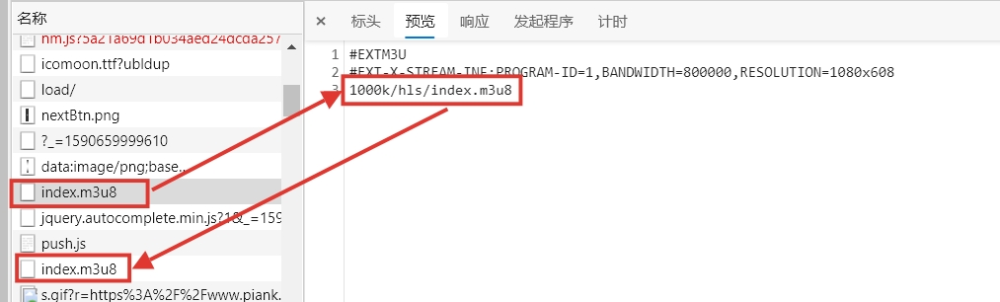
不信？那就看看吧：
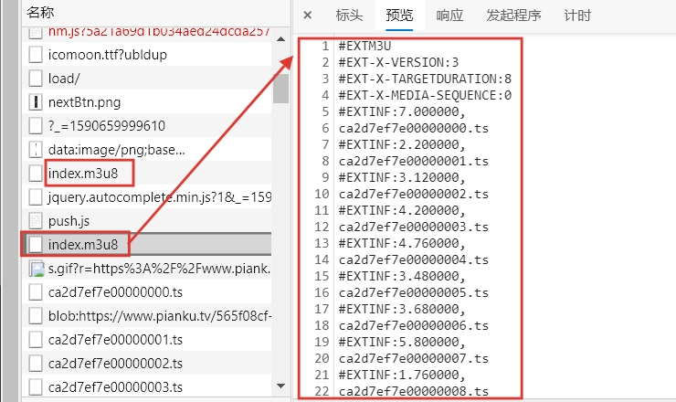

- 经过验证，的的确确是第二个没错了，所以，**接下来的问题是**：这个链接是怎么出来的？

打开 **第一集** 的**网页源码**可以看到：这第一个 **index.m3u8** 文件的链接就在源代码中：
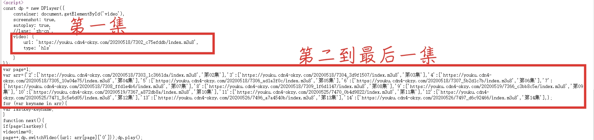
我们可以看到，每一集的 **伪链接**（第一个 **index.m3u8** 文件) 都在这里了。

> **注解：** 这里必须从第一集开始分析爬取，**为什么？** 那是因为当我们选择的不是第一集的话，播放页的源码中将会只含有从本集开始到最新一集的链接，之前的都没有。这就是我一直强调第一集的原因。

至此，我们也看到了所有的链接都包含在 **\<script>...\</script>** 的标签中。可是，标签的内容全是字符串，既不是 **JSON** 格式，也没有网页标签。该如何提取呢？<br>
**答案是：** 正则表达式！
通过正则表达式，我们可以提取任意满足表达式的字符串，在这里，我用了很简单的表达式来方便大家看懂：

```python
def get_video(url):
    # 正确的链接拼接
    URL = 'https://www.****.tv/ajax/downurl/' + url.split('/')[-1].split('.')[0] + '_'+url.split('/')[3]+'/'  # 根据重定向拼接真实的链接
    # 请求视频链接
    response = requests_url(URL)
    # 找到每一集的链接
    soup = BeautifulSoup(response.text, 'html.parser').find('ul', attrs={'class': "player ckp"}).find('li').a.attrs['href']
    # 重新拼接每一集主页链接
    URL1 = 'https://www.****.tv' + soup
    response1 = requests_url(URL1).text
    soup1 = BeautifulSoup(response1, 'html.parser').find_all('script')[12]  # 获取script标签
    # 通过正则表达式找出所有下载链接
    p = re.compile(r"https://.*?/index.m3u8")
    information = p.findall(str(soup1))
    num = 1
    for info in information:

        download['第{}集'.format(num)] = str(info).replace('index.m3u8','1000k/hls/index.m3u8')
        num += 1
```

现在我们已经获取到了每一集的第一个 **index.m3u8** 文件链接，怎么才能跳转到第二个 **index.m3u8** 文件链接呢？
我们继续观察两个链接的区别在哪里：

> 第一个：
> https://\*\*\*\*.com/20200518/7302_c75efddb/index.m3u8
> 第二个：
> https://\*\*\*\*.com/20200518/7302_c75efddb/1000k/hls/index.m3u8

看出来了吗？对了，就是增添了路径而已，这样的话，继续添加代码：

```python
def get_video(url):
   '''
   与上面的代码一样,所以就省略了
   '''
    response1 = requests_url(URL1).text
    # 获取script标签
    soup1 = BeautifulSoup(response1, 'html.parser').find_all('script')[12]
    # 通过正则表达式找出所有下载链接
    p = re.compile(r"https://.*?/index.m3u8")
    information = p.findall(str(soup1))
    num = 1
    for info in information:
     # download = {}   是全局变量
        download['第{}集'.format(num)] = str(info).replace('index.m3u8','1000k/hls/index.m3u8')
        num += 1
```

到目前为止，我们已经获得了所有的 **m3u8** 格式的真实链接。接下来就是下载的问题了，最简单的就是使用 ffmpeg 来下载。
**使用方法：**

```python
import ffmpy3
ffmpy3.FFmpeg(inputs={'http://***.m3u8': None}, outputs={name + '.mp4':None}).run()
```

**[FFmpeg](https://ffmpeg.zeranoe.com/builds/)** 可以帮你下载 **m3u8** 格式的视频，而且还能帮你自动转换为 **mp4** 的格式，并且不会出现拼接 **ts** 文件时乱序的情况。

或者使用我之前介绍的一种方法：[用最普通的方法爬取 ts 文件并合成为 mp4 格式](../skill/m3u8.md)。

---

### 源码及运行过程示例

#### 源码

```python
import re
import os
import time
import ffmpy3
import random
import parsel
import requests
from bs4 import BeautifulSoup
from urllib.parse import quote
from multiprocessing.pool import ThreadPool

referer = 'https://www.****.tv'
header = {
    'referer': referer,
    'user-agent': 'Mozilla/5.0 (Windows NT 10.0; Win64; x64) AppleWebKit/537.36 (KHTML, like Gecko) Chrome/83.0.4103.61 Safari/537.36 Edg/83.0.478.37'
}
proxies = ['HTTP://60.13.42.120:9999', 'HTTP://163.204.244.207:9999', 'HTTP://113.121.39.121:9999',
           'HTTP://125.117.134.99:9000', 'HTTP://123.169.114.81:9999', 'HTTP://58.253.159.230:9999',
           'HTTP://182.46.99.247:9999', 'HTTP://171.15.48.235:9999', 'HTTP://120.83.105.226:9999',
           'HTTP://113.124.95.210:9999', 'HTTP://171.13.103.241:9999', 'HTTP://123.163.96.42:9999',
           'HTTP://27.42.168.46:49345', 'HTTP://122.234.27.22:9000', 'HTTP://125.108.73.47:9000',
           'HTTP://125.108.97.209:9000', 'HTTP://113.124.85.24:9999', 'HTTP://27.220.51.228:9000',
           'HTTP://113.124.84.205:9999', 'HTTP://110.243.31.147:9999']

path = './Spider/'
video = {}  # 保存搜索记录
download = {}  # 保存下载链接

def requests_url(url):  # 请求网址
    try:
        proxy = {'http': random.choice(proxies)}
        print(proxy)
        r = requests.get(url, proxies=proxy, headers=header)
        r.raise_for_status()
        r.encoding = 'UTF-8'
        return r
    except:
        print("*********请求失败！***********")

def split_info(videos_info):
    num = 1
    for video_info in videos_info:
        info = str(video_info).replace('<em>', '').replace('</em>', '')  # 去掉源码中红色字体的标注
        soup = BeautifulSoup(info, 'html.parser')
        info = soup.find_all('p')
        # 将通过关键字搜索到的视频名与对应链接保存下来 （对应链接为拼接后的完整链接，如：https://www.****.tv/tv/wNiNmMnRjZ.html）
        video[info[0].strong.a.string + info[0].span.string] = 'https://www.pianku.tv' + info[0].strong.a.attrs['href']
        name2_info = info[1].string  # 又名
        area_info = info[2].string  # 地区与类型
        actor_info = info[3].string  # 演员
        introduction = info[4].string  # 简介
        print('***********************************************************')
        print('{:0>2d}: '.format(num), end='')
        num += 1
        print('\t' + info[0].strong.a.string + info[0].span.string)  # 名称
        print('\t' + name2_info)
        print('\t' + area_info)
        print('\t' + actor_info)
        print('\t' + introduction)

def get_video(url):
    global referer
    referer = url
    # 根据重定向拼接真实的链接
    URL = 'https://www.****.tv/ajax/downurl/' + url.split('/')[-1].split('.')[0] + '_' + url.split('/')[3] + '/'
    # 请求视频链接
    response = requests_url(URL)
    soup = \
        BeautifulSoup(response.text, 'html.parser').find('ul', attrs={'class': "player ckp"}).find('li').a.attrs[
            'href']  # 找到每一集的链接
    URL1 = 'https://www.****.tv' + soup  # 重新拼接每一集主页链接
    response1 = requests_url(URL1).text
    soup1 = BeautifulSoup(response1, 'html.parser').find_all('script')[12]  # 获取script标签
    # 通过正则表达式找出所有下载链接
    p = re.compile(r"https://.*?/index.m3u8")
    information = p.findall(str(soup1))
    num = 1
    for info in information:
        download['第{}集'.format(num)] = str(info).replace('index.m3u8', '1000k/hls/index.m3u8')
        num += 1

def video_download(name):  # 通过ffmpy3下载
    try:
        if os.path.exists(path + NAME + '/'):
            pass
        else:
            os.makedirs(path + NAME + '/')
        ffmpy3.FFmpeg(inputs={download[name]: None}, outputs={path + NAME + '/' + name + '.mp4': None}).run()
        print('************' + name + '下载成功！' + '************')
    except:
        print('============' + name + '下载失败！' + '============')

def user_ui():
    global NAME, page_num
    print('***********************************************************')
    keyword = '传闻中'  # input('请输入搜索的视频关键字：')
    url = 'https://www.****.tv/s/go.php?q=' + quote(keyword, 'utf-8')  # 进行url加密
    URL = (url.split('go.php?q=')[0] + url.split('go.php?q=')[1]).replace('%', '_') + '.html'  # 根据网页，更改加密后的url
    html = requests_url(URL).text
    search_time = parsel.Selector(html).xpath('//div[@class="breadcrumbs"]/text()').extract()[0]  # 搜索时间以及数量
    videos_info = parsel.Selector(html).xpath('//dd').extract()  # 视频信息标签
    try:  # 若搜索结果小于10项，则无页码信息
        print(search_time, end='')
        page_num = parsel.Selector(html).xpath('//div[@class="pages"]/a/text()').extract()[-2]
        print('，共{}页。每页10项。'.format(page_num))
    except:
        print(end='\n')
    split_info(videos_info)  # 拆分显示视频信息
    choice = input('\n请输入序号选择：')
    NAME = list(video.keys())[int(choice) - 1]  # 通过下标确定进一步搜索的类容
    URL = video[NAME]
    get_video(URL)  # 获取下载链接

user_ui()

time1 = time.time()
pool = ThreadPool(10)  # 开启线程池
results = pool.map(video_download, download.keys())
pool.close()
pool.join()
time2 = time.time()
print('*********耗时：{}*********'.format(time2 - time1))
```

#### 运行过程示例

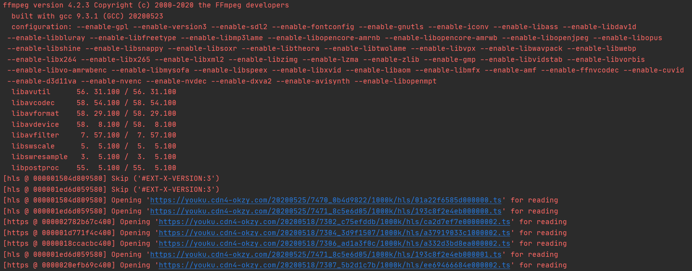
